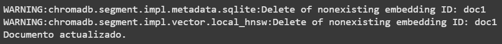
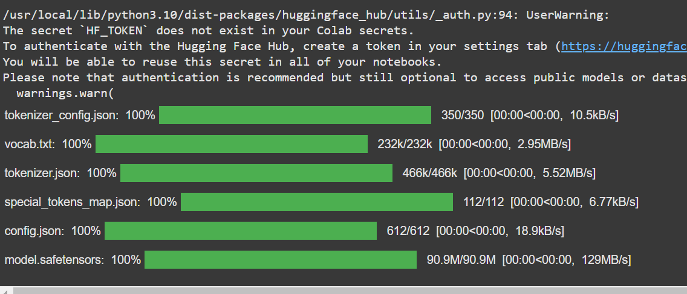

# Embeddings y Chroma

## Instalaciones

| Instalacion   | Descripcion  |
|----------------|----------------|
| ```!pip install chromadb``` | Instalamos chroma para el uso de la base de datos por vectores |
|```pip install chroma-migrate```|Opcionalmente podemos usar datos para importarlos|
|```pip install transformers```|El uso de los transformers sirve optimizar el procesamiento de datos de una api en hughinface|

## chroma

### crear o obtener coleccion en chroma

```python
import chromadb

# Crear un cliente de Chroma
client = chromadb.Client()

# Conectar con persistencia
#client = chromadb.PersistentClient(persist_directory="./chroma_data")

# Crear o obtener una colección
collection = client.get_or_create_collection(name="mi_coleccion")
print("Colección creada:", collection.name)
```

resultado:


### crear datos en chroma

primero creamos datos en chroma
```python
historia="""Fundada en 2009 en Medellín, Tiendas D1 se convirtió en la primera cadena de descuento en Colombia, introduciendo un formato que transformó las compras de los colombianos. Actualmente, cuenta con más de 24,000 empleados y más de 2,500 tiendas en 31 departamentos y 520 municipios, cubriendo el 87% del territorio nacional. Su objetivo es ofrecer productos de alta calidad a precios bajos, posicionándose como la primera opción de compra para los consumidores."""

horarios=""" Los horarios de atención de Tiendas D1 suelen ser de 7:00 a.m. a 9:00 p.m. Sin embargo, estos pueden variar según la ubicación y las regulaciones locales. Se recomienda consultar el horario específico de la tienda más cercana para obtener información precisa."""

productos="""Tiendas D1 ofrece una amplia variedad de productos, incluyendo alimentos, bebidas, productos de limpieza, artículos para el hogar y más. Una característica distintiva es su enfoque en marcas propias de excelente calidad, muchas de las cuales son de industria nacional. Además, promueven la sostenibilidad y la inclusión social en sus operaciones."""
```

### Agregamos los datos en la base de datos vectorial

```python
data = {
    "documents": [historia, horarios, productos],
    "metadatas": [{"source":"Como se creó"},{"source":"horario para entrar y salir a comprar"},{"source":"lo que puedo comprar"}],
    "ids": ["id1","id2","id3"]
}

collection.add(**data)
print("Documentos agregados correctamente.")
```


### leer o consultar datos

```python
# Leer todos los documentos
resultados = collection.get()

# Verificar si hay documentos
if resultados:
    print("Documentos en la colección:")
    for idx, doc in enumerate(resultados['documents']):
        print(f"\nDocumento {idx + 1}:")
        print(f"  Contenido: {doc}")
        #print(f"  Embeddings: {resultados['embeddings'][idx]}")
        print(f"  Metadata: {resultados['metadatas'][idx]}")
        print(f"  IDs: {resultados['ids'][idx]}")
else:
    print("No hay documentos en la colección.")
```
resultado:


### query

Se trata de las búsquedas semánticas, usa la base de datos vectorial para lograr encontrar la similitud más acertada, cabe aclarar que esto es una busqueda basada en texto dentro de la base de datos vectoriall. Esto puede funcionar, pero no aprovecha el poder de las búsquedas semánticas, que son el verdadero propósito de una base de datos vectorial como ChromaDB.

```python
results = collection.query(
    query_texts=["¿Que productos venden en las tiendas d1?"],
    n_results=2  #Número de resultados
)

for i, (doc, metadata, distance) in enumerate(
    zip(results['documents'][0], results['metadatas'][0], results['distances'][0])
):
    print(f"Resultado {i+1}:")
    print(f"- Documento: {doc}")
    print(f"- Metadata: {metadata}")
    print(f"- Distancia: {distance}")
    print("-" * 40)
```

resultado:


recordar que hay que ser muy especifico en la pregunta para obtener una respuesta, se basa en encontrar palabras en la base de datos por documentos

### Actualizar o modificar datos

Chroma no tiene una operación explícita de "actualizar", pero puedes eliminar y volver a insertar los datos:

```python
# Actualizar un documento (Eliminar e insertar de nuevo)
collection.delete(ids=["doc1"])
collection.add(ids=["doc1"], documents=["Documento actualizado"], metadatas=[{"autor": "Pedro"}])  # Agregar de nuevo
print("Documento actualizado.")
```



en este caso creo que no existe doc 1 pero de igual manera funciona solo es colocar el id en el codigo del elemento o documento que desea actualizar y listo.

### Eliminar Datos

es muy simple

```python
# Eliminar documentos por ID
collection.delete(ids=["id1"])
print("Documento eliminado.")
```


## Embeddings

con embeddings no hay necesidad de hacer preguntas tan especificas, pero es necesidad el uso de los transformers con hugghingface y usar un modelo, en este caso definimos datos

```python
from transformers import AutoTokenizer, AutoModel
import torch

# Cargar el modelo y el tokenizador
modelo = "sentence-transformers/all-MiniLM-L6-v2"
tokenizer = AutoTokenizer.from_pretrained(modelo)
model = AutoModel.from_pretrained(modelo)
```

resultado:


### creamos una función para generar embeddings

lo siguiente es una funcion que convierte el texto en vectores:

```python
def generar_embedding(texto):
    # Tokenizar el texto
    tokens = tokenizer(
        texto,
        padding=True,  # Agrega padding si es necesario
        truncation=True,  # Trunca si el texto es muy largo
        return_tensors="pt"  # Retorna tensores de PyTorch
    )

    # Pasar los tokens al modelo para obtener embeddings
    with torch.no_grad():
        output = model(**tokens)
        # La última capa oculta (hidden state)
        embeddings = output.last_hidden_state
        # Pooling para obtener un solo vector representativo del texto
        embeddings = torch.mean(embeddings, dim=1)

    return embeddings.squeeze().numpy()  # Convertir a numpy array
```

### eliminamos y agregamos datos mas acertados

```python

collection.delete(ids=["id1"])
collection.delete(ids=["id2"])
collection.delete(ids=["id3"])

data = {
    "documents": [
        "Fundada en 2009 en Medellín, Tiendas D1 se convirtió en la primera cadena de descuento en Colombia.",
        "Las horas de atención de Tiendas D1 suelen ser de 7:00 a.m. a 9:00 p.m. El horario puede variar.",
        "Tiendas D1 ofrece una amplia variedad de productos, incluyendo alimentos, bebidas y artículos para el hogar."
    ],
    "metadatas": [
        {"source": "Como se creó", 'categoria': 'historia'},
        {"source": "horario para entrar y salir", 'categoria': 'horarios'}, 
        {"source": "lo que puedo comprar", 'categoria': 'productos'}
    ],
    "ids": ["id1", "id2", "id3"],
    "embeddings": [
        generar_embedding("La historia sobre el D1 es fascinante."),
        generar_embedding("D1 ofrece horarios convenientes para sus clientes."),
        generar_embedding("Los productos en D1 son económicos y variados.")
    ],
}

# Agregar documentos a la colección
collection.add(**data)
print("Documentos agregados correctamente.")
```

resultado:


### Hacer consultas con embedings

```python
from sklearn.feature_extraction.text import TfidfVectorizer
from sklearn.metrics.pairwise import cosine_similarity

def calcular_similitud(query, texto):
    """
    Calcula la similitud de coseno entre la consulta y un texto.
    """
    vectorizador = TfidfVectorizer().fit([query, texto])
    vectores = vectorizador.transform([query, texto])
    return cosine_similarity(vectores[0], vectores[1])[0][0]

def buscar_mejor_coincidencia(query, collection):
    """
    Busca el documento y metadato más similar a la consulta.
    """
    # Generar el embedding de la consulta
    query_embedding = generar_embedding(query)

    # Realizar la consulta inicial para obtener documentos
    results = collection.query(
        query_embeddings=[query_embedding],
        n_results=1  # Cuantos resultados desea
    )

    documentos = results['documents'][0]
    metadatos = results['metadatas'][0]

    # Evaluar similitudes con todos los resultados
    mejores_resultados = []
    for doc, meta in zip(documentos, metadatos):
        texto_completo = f"{doc} {meta}"  # Combinar documento y metadatos
        similitud = calcular_similitud(query, texto_completo)
        mejores_resultados.append((doc, meta, similitud))

    # Ordenar por similitud descendente
    mejores_resultados = sorted(mejores_resultados, key=lambda x: x[2], reverse=True)

    # Mostrar el resultado más relevante
    if mejores_resultados:
        mejor_doc, mejor_meta, mejor_similitud = mejores_resultados[0]
        print("Mejor coincidencia encontrada:")
        print(f"- Documento: {mejor_doc}")
        print(f"- Metadata: {mejor_meta}")
        print(f"- Similitud: {mejor_similitud:.2f}")
    else:
        print("No se encontraron coincidencias relevantes.")

# Consulta del usuario
query = "a que hora abren en la tienda??"

# Realizar la búsqueda con la mejor coincidencia
buscar_mejor_coincidencia(query, collection)
```

resultado:


## Filtros personalizados

# Categorías en ChromaDB vs Bases de Datos Relacionales

Las **categorías** en ChromaDB funcionan más como etiquetas o metadatos asociados a un documento, en lugar de estructuras estrictamente definidas como tablas en una base de datos relacional. A continuación, se explican las similitudes y diferencias clave entre este enfoque basado en metadatos y el de las bases de datos relacionales tradicionales:

---

## Similitudes con Tablas

1. **Organización Lógica**:  
   Las categorías actúan como una forma de agrupar documentos que comparten propiedades comunes, similar a cómo las tablas agrupan filas relacionadas en una base de datos relacional.

2. **Consulta por Categorías**:  
   Puedes buscar documentos que pertenezcan a ciertas categorías de manera análoga a realizar una consulta filtrada en una tabla.

---

## Diferencias Principales

| **Aspecto**                 | **ChromaDB (NoSQL basado en vectores)**         | **Base de Datos Relacional**               |
|-----------------------------|-----------------------------------------------|-------------------------------------------|
| **Estructura**              | No tiene un esquema fijo. Cada documento puede tener metadatos diferentes. | Esquema fijo definido por tablas, columnas y relaciones. |
| **Flexibilidad en Categorías** | Un documento puede pertenecer a múltiples categorías simultáneamente (metadatos como listas). | Las categorías suelen representarse mediante relaciones (p. ej., tablas intermedias o claves foráneas). |
| **Relaciones**              | No hay relaciones estrictas entre documentos, aunque puedes simular asociaciones mediante metadatos. | Relación estricta entre tablas mediante claves primarias y foráneas. |
| **Consultas**               | Consultas basadas en similitudes (vectores) y filtrado de metadatos. | Consultas basadas en operaciones SQL estructuradas. |
| **Escalabilidad**           | Diseñado para manejar grandes volúmenes de datos no estructurados. | Diseñado para datos estructurados y transacciones complejas. |
| **Filosofía**               | Optimizado para búsquedas semánticas y análisis vectorial. | Optimizado para integridad referencial y transacciones. |

---

## Ejemplo Comparativo

### En una Base de Datos Relacional:

Si tienes categorías como "productos", "historia" y "horarios", podrías tener tablas específicas para cada una:

- Una tabla `Productos` con columnas como `id`, `nombre`, `precio`, etc.
- Una tabla `Horarios` con columnas como `id`, `hora_apertura`, `hora_cierre`, etc.
- Relaciones entre tablas (p. ej., `Productos` y `Categorías` mediante una tabla intermedia).

---

### En ChromaDB:

En lugar de tablas, cada documento es un objeto autónomo con metadatos que definen a qué categorías pertenece. Ejemplo:

```json
{
    "document": "Horarios de apertura",
    "metadata": {
        "categorias": ["horarios", "información"],
        "source": "Horario para entrar y salir a comprar"
    }
}
```

despues creamos el codigo y hacemos las busquedas por categoria:

```python
# Filtros personalizados
def buscar_por_filtro(collection, categoria=None):
    """
    Busca documentos en la colección basándose en un filtro de metadatos.
    """
    filtros = {}
    if categoria:
        filtros["categoria"] = categoria

    resultados = collection.query(
        query_texts=[""],  # Query vacío porque filtramos solo por metadatos
        n_results=10,
        where=filtros  # Filtrar por metadatos
    )

    if resultados["documents"]:
        print("\nDocumentos filtrados:")
        for idx, (doc, meta) in enumerate(zip(resultados["documents"][0], resultados["metadatas"][0])):
            print(f"\nDocumento {idx + 1}:")
            print(f"  Contenido: {doc}")
            print(f"  Metadata: {meta}")
    else:
        print("No se encontraron documentos con los filtros proporcionados.")
```

resultados:

```python
print("\n--- Búsqueda por categoría: 'productos' ---")
buscar_por_filtro(collection, categoria="productos")

print("\n--- Búsqueda por categoría: 'historia' ---")
buscar_por_filtro(collection, categoria="historia")

print("\n--- Búsqueda por categoría: 'horarios' ---")
buscar_por_filtro(collection, categoria="horarios")
```

resultados:


### mostrar todo menos....

```python
# Crear un filtro para excluir documentos de una categoría específica
categoria_a_excluir = "horarios"

# Obtener todos los documentos
all_results = collection.get()

# Filtrar los resultados para excluir la categoría deseada
filtered_results = {
    "documents": [],
    "metadatas": [],
    "ids": []
}

for i in range(len(all_results["documents"])):
    if categoria_a_excluir not in all_results["metadatas"][i].get("categoria", []): # Check if categoria_a_excluir is not in the 'categoria' list (or if 'categoria' is missing)
        filtered_results["documents"].append(all_results["documents"][i])
        filtered_results["metadatas"].append(all_results["metadatas"][i])
        filtered_results["ids"].append(all_results["ids"][i])

# Mostrar resultados
if filtered_results["documents"]:
    print("Documentos sin la categoría excluida:")
    for idx, doc in enumerate(filtered_results["documents"]):
        print(f"\nDocumento {idx + 1}:")
        print(f"  Contenido: {doc}")
        print(f"  Metadata: {filtered_results['metadatas'][idx]}")
        print(f"  ID: {filtered_results['ids'][idx]}")
else:
    print("No hay documentos que cumplan con los criterios.")
```

resultado:

